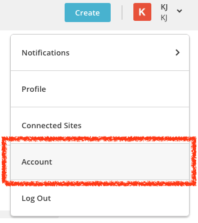
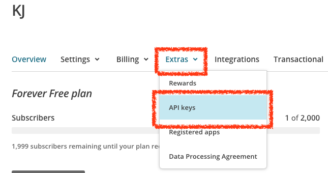
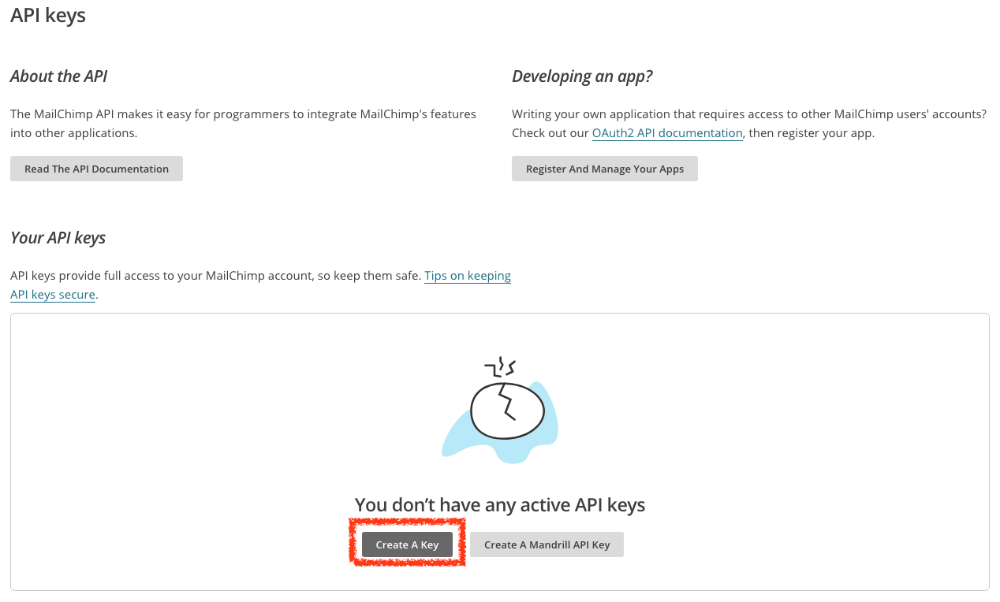
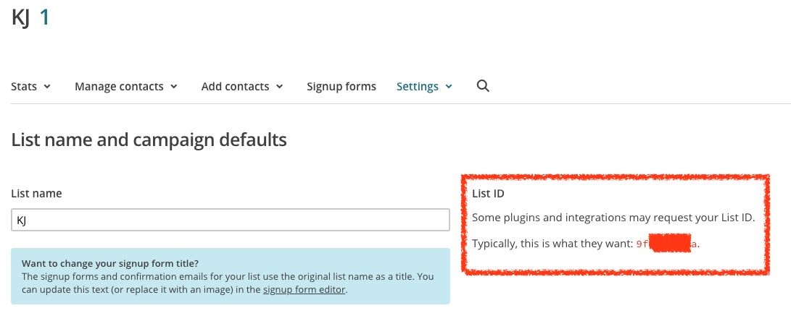

# Laravel Mailchimp

## 取得 API Key

登入 MailChimp 後，在右上方帳號選單中，選擇 `Account`



在帳號選單頁面中，選擇 `Extras` 選單中的 `API keys`



在 API keys 頁面中，點選 `Create A Key`，建立 API Key



點選完後就可以看到你的 API Key 了


## 取得 API 網址前綴

在 API 的網址可以看到前方有 `<dc>` 的字樣，`<dc>` 是要看自己所屬的服務是哪一個區域，可以登入 MailChimp 後從網址那邊取得如下

```
https://<dc>.api.mailchimp.com/3.0
```

可以看到網址是 `https://us19.admin.mailchimp.com/lists/`，所以 API Key 的 `<dc>` 就是 `us19`


## 取得清單編號 List ID

Mailchimp 可以管理許多不同的郵件清單，為了管理清單資料，需要有清單編號（List ID），到清單頁點選您要管理的清單


在清單頁從 `Settings` 選單中點選 `List name and defaults` 選項


在 `List name and defaults` 頁面中可以看到清單編號（List ID）在右上方




## 安裝套件

*Laravel : ~5.1.0|~5.2.0|~5.3.0|~5.4.0*

**1. Composer 下載安裝**

```shell
composer require "spatie/laravel-newsletter:3.7.*"
```

**2. 設定 `app.php`**

```php
// config/app.php
return [
    'providers' => [
        ...
        Spatie\Newsletter\NewsletterServiceProvider::class,
        ...
    ],
    // config/app.php
    'aliases' => [
        ..
        'Newsletter' => Spatie\Newsletter\NewsletterFacade::class,
    ],
]
```

**3. 發佈產生設定檔**

```shell
php artisan vendor:publish --provider="Spatie\Newsletter\NewsletterServiceProvider"
```

**4. 設定 Mailchimp API Key & List Key**

在 `config/laravel-newsletter.php` 設定檔中可以設定 API Key & List Key

```php
return [
    'apiKey' => env('MAILCHIMP_APIKEY'),
    'lists' => [
        'subscribers' => [
             'id' => env('MAILCHIMP_LIST_ID'),
        ],
    ],
];
```

可以到 `.env` 檔案中加入剛剛取得的 API Key & List Key


```shell
# .env
MAILCHIMP_APIKEY=xxxxxxx
MAILCHIMP_LIST_ID=yyyyyyy
```

## 是否有此 email

```php
// 回傳 true or false
$is_member_exist = Newsletter::hasMember($email);
```

## 訂閱

```php
$SubscribeMember = Newsletter::subscribe($email);
```

訂閱後，在回傳資料的 `status` 欄位會看到狀態為 `subscribed`，曾經訂閱過的使用者無法再使用 `subscribe()` 去做訂閱，需要用 `subscribeOrUpdate()` 方法去做訂閱的更新

```php
$SubscribeMember = [
    "id"               => "b08f6000ef0269370bc6d664a0bc42ae",
    "email_address"    => "kj@kejyun.com",
    "unique_email_id"  => "0c5596db5d",
    "email_type"       => "html",
    "status"           => "subscribed",
    "merge_fields"     => [
        "FNAME"    => "",
        "LNAME"    => "",
        "ADDRESS"  => "",
        "PHONE"    => "",
        "BIRTHDAY" => "",
    ],
    "stats"            => [
        "avg_open_rate"  => 0,
        "avg_click_rate" => 0,
    ],
    "ip_signup"        => "",
    "timestamp_signup" => "",
    "ip_opt"           => "1.1.1.1",
    "timestamp_opt"    => "2018-08-24T08:30:44+00:00",
    "member_rating"    => 2,
    "last_changed"     => "2018-08-24T08:30:44+00:00",
    "language"         => "",
    "vip"              => false,
    "email_client"     => "",
    "location"         => [
        "latitude"     => 0,
        "longitude"    => 0,
        "gmtoff"       => 0,
        "dstoff"       => 0,
        "country_code" => "",
        "timezone"     => "",
    ],
    "tags_count"       => 0,
    "tags"             => [],
    "list_id"          => "9fe4ab289a",
];
```

## 取得會員資料

```php
$Member = Newsletter::getMember($email);
```

```php
$Member = [
    "id"               => "4bd1ccfqwdqwbtrbrtc8e064b7e037b5826",
    "email_address"    => "kj@kejyun.com",
    "unique_email_id"  => "20bb281925",
    "email_type"       => "html",
    "status"           => "subscribed",
    "merge_fields"     => [
        "FNAME"    => "KJ",
        "LNAME"    => "Proj",
        "ADDRESS"  => [
            "addr1"   => "",
            "addr2"   => "",
            "city"    => "",
            "state"   => "",
            "zip"     => "",
            "country" => "US",
        ],
        "PHONE"    => "",
        "BIRTHDAY" => "",
    ],
    "stats"            => [
        "avg_open_rate"  => 0,
        "avg_click_rate" => 0,
    ],
    "ip_signup"        => "",
    "timestamp_signup" => "",
    "ip_opt"           => "1.1.1.1",
    "timestamp_opt"    => "2018-08-24T07:16:30+00:00",
    "member_rating"    => 2,
    "last_changed"     => "2018-08-24T07:16:30+00:00",
    "language"         => "en",
    "vip"              => false,
    "email_client"     => "",
    "location"         => [
        "latitude"     => 0,
        "longitude"    => 0,
        "gmtoff"       => 0,
        "dstoff"       => 0,
        "country_code" => "",
        "timezone"     => "",
    ],
    "tags_count"       => 0,
    "tags"             => [],
    "list_id"          => "9fe4ab289a",
];
```

## 解除訂閱

```php
Newsletter::unsubscribe($email);
```

解除訂閱後，在回傳資料的 `status` 欄位會看到狀態為 `unsubscribed`，`unsubscribe_reason` 則會看到為 `N/A (Unsubscribed by admin)`


```php
$UnSubscribeMember = [
    "id"                 => "b08f6000ef0269370bc6d664a0bc42ae",
    "email_address"      => "kj@kejyun.com",
    "unique_email_id"    => "0c5596db5d",
    "email_type"         => "html",
    "status"             => "unsubscribed",
    "unsubscribe_reason" => "N/A (Unsubscribed by admin)",
    "merge_fields"       => [
        "FNAME"    => "",
        "LNAME"    => "",
        "ADDRESS"  => "",
        "PHONE"    => "",
        "BIRTHDAY" => "",
    ],
    "stats"              => [
        "avg_open_rate"  => 0,
        "avg_click_rate" => 0,
    ],
    "ip_signup"          => "",
    "timestamp_signup"   => "",
    "ip_opt"             => "1.1.1.1",
    "timestamp_opt"      => "2018-08-24T08:30:44+00:00",
    "member_rating"      => 2,
    "last_changed"       => "2018-08-24T08:57:21+00:00",
    "language"           => "",
    "vip"                => false,
    "email_client"       => "",
    "location"           => [
        "latitude"     => 0,
        "longitude"    => 0,
        "gmtoff"       => 0,
        "dstoff"       => 0,
        "country_code" => "",
        "timezone"     => "",
    ],
    "tags_count"         => 0,
    "tags"               => [],
    "list_id"            => "9fe4ab289a",
];
```


## 訂閱或更新使用者資料


```php
$subscribe_member_info = [
    'FNAME'    => 'KJ',
    'LNAME'    => 'Hong',
    'PHONE'    => '0900000000',
];
$SubscribeMember = Newsletter::subscribeOrUpdate($email, subscribe_member_info);
```

訂閱後，在回傳資料的 `status` 欄位會看到狀態為 `subscribed`，也可以看到使用者的個人資料更新了

```php
$SubscribeMember = [
    "id"               => "b08f6000ef0269370bc6d664a0bc42ae",
    "email_address"    => "kj@kejyun.com",
    "unique_email_id"  => "0c5596db5d",
    "email_type"       => "html",
    "status"           => "subscribed",
    "merge_fields"     => [
        "FNAME"    => "KJ",
        "LNAME"    => "Hong",
        "ADDRESS"  => "",
        "PHONE"    => "0900000000",
        "BIRTHDAY" => "",
    ],
    "stats"            => [
        "avg_open_rate"  => 0,
        "avg_click_rate" => 0,
    ],
    "ip_signup"        => "",
    "timestamp_signup" => "",
    "ip_opt"           => "1.1.1.1",
    "timestamp_opt"    => "2018-08-24T08:30:44+00:00",
    "member_rating"    => 2,
    "last_changed"     => "2018-08-24T09:11:58+00:00",
    "language"         => "",
    "vip"              => false,
    "email_client"     => "",
    "location"         => [
        "latitude"     => 0,
        "longitude"    => 0,
        "gmtoff"       => 0,
        "dstoff"       => 0,
        "country_code" => "",
        "timezone"     => "",
    ],
    "tags_count"       => 0,
    "tags"             => [],
    "list_id"          => "9fe4ab289a",
];
```

## 更新使用者 Email

```php
$UpdateMemberEmail = Newsletter::updateEmailAddress($old_email, $new_email);
```

若新的 email 已存在，則會無法更新

```php
$UpdateMemberEmail = [
    "id"               => "11d3e8047829c996b4602f92bdfdc2f9",
    "email_address"    => "kj.new@kejyun.com",
    "unique_email_id"  => "21b5f58334",
    "email_type"       => "html",
    "status"           => "subscribed",
    "merge_fields"     => [
        "FNAME"    => "KJ",
        "LNAME"    => "Hong",
        "ADDRESS"  => "",
        "PHONE"    => "0900000000",
        "BIRTHDAY" => "",
    ],
    "stats"            => [
        "avg_open_rate"  => 0,
        "avg_click_rate" => 0,
    ],
    "ip_signup"        => "",
    "timestamp_signup" => "",
    "ip_opt"           => "1.1.1.1",
    "timestamp_opt"    => "2018-08-24T08:30:44+00:00",
    "member_rating"    => 2,
    "last_changed"     => "2018-08-24T09:46:24+00:00",
    "language"         => "",
    "vip"              => false,
    "email_client"     => "",
    "location"         => [
        "latitude"     => 0,
        "longitude"    => 0,
        "gmtoff"       => 0,
        "dstoff"       => 0,
        "country_code" => "",
        "timezone"     => "",
    ],
    "tags_count"       => 0,
    "tags"             => [],
    "list_id"          => "9fe4ab289a",
];
```

## 刪除使用者 email

> 刪除使用者 email，是指整個 email 從此消失，再也找不回來了

```php
$delete_status = Newsletter::delete($email);
```

刪除成功會回傳 `true`，刪除失敗則會將失敗的原因回傳

```php
// 刪除失敗
$delete_status = [
    "type"     => "http://developer.mailchimp.com/documentation/mailchimp/guides/error-glossary/",
    "title"    => "Resource Not Found",
    "status"   => 404,
    "detail"   => "The requested resource could not be found.",
    "instance" => "bb6db1ab-97e6-4da7-9db3-f97b5588ce3e",
];
```


## 取得使用者近期活動資訊

```php
$MemberActivity = Newsletter::getMemberActivity($email);
```

```php
$MemberActivity = [
    "activity"    => [
        0 => [
            "action"      => "unsub",
            "timestamp"   => "2018-08-24T08:57:21+00:00",
            "type"        => "A",
            "campaign_id" => "",
        ],
    ],
    "email_id"    => "b08f6000ef0269370bc6d664a0bc42ae",
    "list_id"     => "9fe4ab289a",
    "total_items" => 1,
];
```


## 參考資料
* [Developer | MailChimp](https://developer.mailchimp.com/)
* [About API Keys | MailChimp](https://mailchimp.com/help/about-api-keys/)
* (MailChimp API Key)[https://us10.admin.mailchimp.com/account/api-key-popup/]
* [spatie/laravel-newsletter: Manage newsletters in Laravel](https://github.com/spatie/laravel-newsletter)
* [Laravel 5.1~5.4：spatie/laravel-newsletter: Manage newsletters in Laravel](https://github.com/spatie/laravel-newsletter/tree/3.7.0)
* [★ Easily integrate MailChimp in Laravel 5 - Freek Van der Herten's blog on PHP and Laravel](https://murze.be/easily-integrate-mailchimp-in-laravel-5)
* [Guide On Laravel 5 and Mailchimp Newsletter- Helpful In Laravel Services](https://medium.com/@AddWebSolution/guide-on-laravel-5-and-mailchimp-newsletter-helpful-in-laravel-services-f56a390ad9b9)


!INCLUDE "../../kejyun/book/laravel-5-for-beginner.md"
