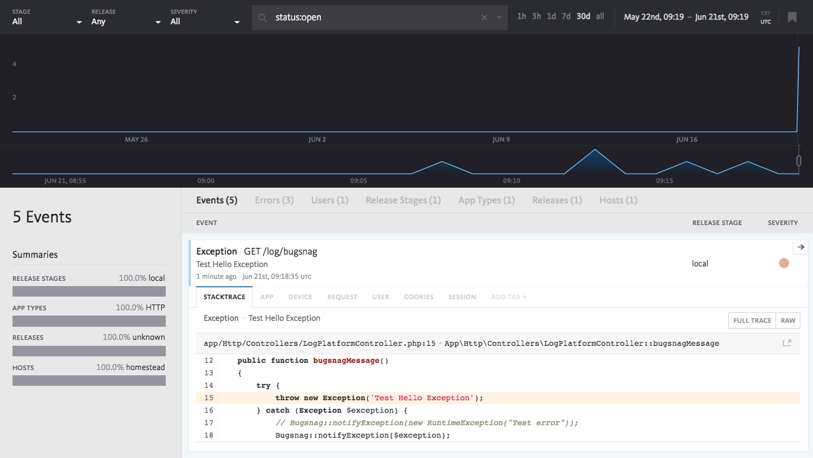
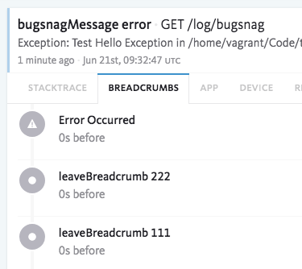

# Bugsnag

> 版本：Laravel 5.0 ~ 5.6

> 紀錄指定的錯誤訊息及系統錯誤

**1. 安裝**

```shell
composer require "bugsnag/bugsnag-laravel:^2.0"
```


**2. 設定 config/app.php**

```php
<?php
// config/app.php
return [
    'providers' => [
        Bugsnag\BugsnagLaravel\BugsnagServiceProvider::class,
    ],
];
```

**3. 設定 API KEY**

到 `.env` 檔案設定 Bugsnag API KEY，根據官方安裝引導可以取得此 API KEY

```shell
# .env
BUGSNAG_API_KEY=<API_KEY>
```


**3. 設定檔**

*Laravel 5.6*

```php
<?php
// config/logging.php:
return [
    'channels' => [
        'stack' => [
            'driver' => 'stack',
            // Add bugsnag to the stack:
            'channels' => ['single', 'bugsnag'],
        ],

        // Create a bugsnag logging channel:
        'bugsnag' => [
            'driver' => 'bugsnag',
        ],
    ],
]
```

*Laravel 5.0~5.5*

到 `app/Providers/AppServiceProvider.php` 檔案中的 `register` 方法加入此設定


```php
class AppServiceProvider extends ServiceProvider
{
    public function register()
    {
        $this->app->alias('bugsnag.logger', \Illuminate\Contracts\Logging\Log::class);
        $this->app->alias('bugsnag.logger', \Psr\Log\LoggerInterface::class);
    }
}
```

**4. 發送錯誤訊息到 Bugsnag**

```php
use Bugsnag\BugsnagLaravel\Facades\Bugsnag;
use RuntimeException;

Bugsnag::notifyException(new RuntimeException("Test error"));
```

**5. 檢視 Bugsnag 錯誤訊息**





**6. 留下麵包屑**

```php
try {
    // 留下麵包屑
    Bugsnag::leaveBreadcrumb('leaveBreadcrumb 111');
    Bugsnag::leaveBreadcrumb('leaveBreadcrumb 222');
    throw new Exception('Test Hello Exception');
} catch (Exception $exception) {
    // 傳送訊息
    Bugsnag::notifyException($exception);
}
```

**7. 檢視麵包屑訊息**

可以看到在程式中留下的麵包屑，可以知道程式在哪一段麵包屑後出錯




## 程式系統錯誤

當程式或系統發生錯誤時，也會記錄相關資訊


## 參考資料
* [Error reporting, monitoring, and resolution with Bugsnag](https://www.bugsnag.com/)
* [bugsnag/bugsnag-laravel: Bugsnag notifier for the Laravel PHP framework. Monitor and report Laravel errors.](https://github.com/bugsnag/bugsnag-laravel)
* [Bugsnag docs › Platforms › PHP › Laravel](https://docs.bugsnag.com/platforms/php/laravel/)


!INCLUDE "../../kejyun/book/laravel-5-for-beginner.md"
